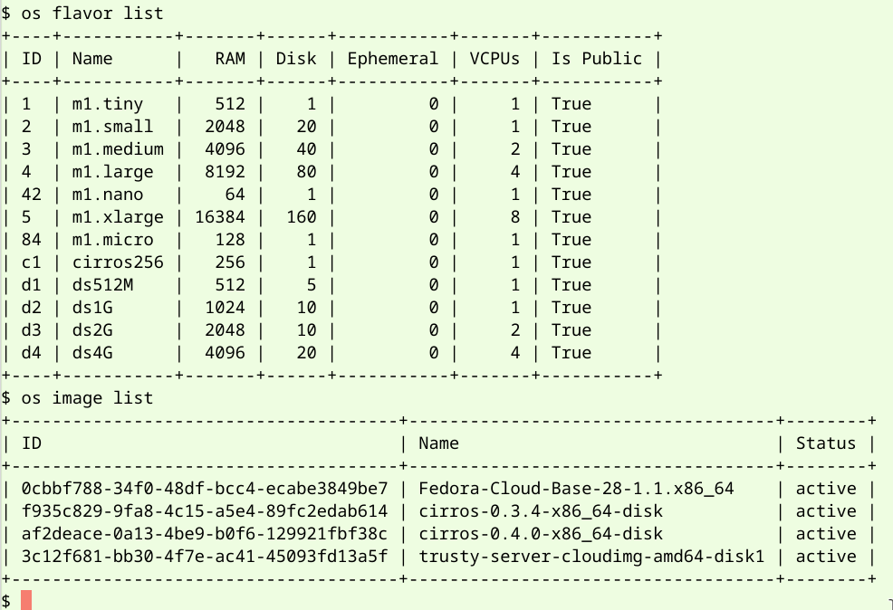

# Environnement Openstack release Stein
Cet espace décrit la méthode et les étapes pour obtenir un environnement dédié (All in One) de **Openstack** release **Stein**, à l'aide du code d'installation et de configuration **DevStack**. La communauté Openstack a développé un ensemble de scripts permettant d'installer et de configurer Openstack et les modules de services retenus sur un environnement physique ou virtuel dédié. Les étapes pour mettre en oeuvre cet environnement sont les suivantes:

 1. Se créer une machine virtuelle Cloud avec des ressources riches en RAM,
 2. Se connecter à la VM, télécharger le code de DevStack pour la release Stein, configurer le contexte Openstack désiré et lancer l'installation,
 3. Configurer l'accès Cloud à la VM et le contexte du tenant pour l'utiliser.

 ### 1. Création d'une VM sur AWS, voire GCP, Azure ou autres
 Le gabarit de la machine virtuelle (VM) retenue doit avoir les caractéristiques ci-dessous afin de pouvoir installer les modules Openstack désirés et à termes de créer plusieurs VM sur le framework Openstack déployé. La configuration AWS pour la VM est celle-ci:
 
 - **OS**: **Ubuntu** Server **16.04** LTS 64 bits (x86)
 - **CPU**:  plusieurs vCores
 - **RAM**: **32** ou **64** Go
 - **DISK**:  **24** à **32** Go / SSD

Si vous maîtrisez la notion de USER DATA (configuration avancée sous AWS), vous pouvez vous appuyer sur le package Cloud-init pour automatiser l'installation et la configuration d'Openstack à la fin du boot de la VM AWS.
 
> NB: En raison du prix à l'heure de la VM, il est prudent de l'utiliser avec parcimonie.

 ### 2. Installation Openstack sur la VM
 #### 2.1. Configuration de la VM d'installation
 Le détail du fichier "contexte.sh" est donné ci-dessous.
 
    $ sudo apt-get update ↩
    $ sudo apt-get install -y git ↩
    $ sudo useradd stack ↩
    $ sudo -i ↩
    # chmod 644 /etc/sudoers ↩
    # echo "stack ALL=(ALL) NOPASSWD: ALL" >> /etc/sudoers ↩
    # mkdir -p /home/stack; chown stack:stack /home/stack ↩
    # exit ↩
    $ sudo su - stack ↩

 #### 2.2. Téléchargement DevStack
  
    $ pwd ↩
    /home/stack
    $ git clone -b stable/stein https://git.openstack.org/openstack-dev/devstack ↩
    ...
    $

 #### 2.3. Configuration Openstack
 La configuration d'installation et de configuration donnée est simple. Elle comprend juste les modules de base comme Nova, Neutron, Cinder, KeyStone, Glance et Horizon. Seul le module Heat supplémentaires avec les services requis est ajouté. Les 3 images OS (Fedora, Ubuntu et Cirros) sont téléchargées et installées sous Glance. Le fichier "local.conf" est donné ci-dessous.

    $ cd devstack ↩
    $ cat > local.conf << EOF
    [[local|localrc]]
    ADMIN_PASSWORD=paris68
    DATABASE_PASSWORD=paris68
    RABBIT_PASSWORD=paris68
    SERVICE_PASSWORD=$ADMIN_PASSWORD
    LOGFILE=$DEST/logs/stack.sh.log
    LOGDAYS=2
    enable_plugin heat https://github.com/openstack/heat.git stable/stein
    enable_service h-eng h-api h-api-cfn h-api-cw
    IMAGE_URLS="http://ftp.free.fr/mirrors/fedora.redhat.com/fedora/linux/releases/28/Cloud/x86_64/images/Fedora-Cloud-Base-28-1.1.x86_64.qcow2, https://cloud-images.ubuntu.com/trusty/current/trusty-server-cloudimg-amd64-disk1.img, http://download.cirros-cloud.net/0.3.4/cirros-0.3.4-x86_64-disk.img"
    EOF ↩ 
 
 #### 2.4. Installation Openstack
 L'installation du framework Openstack prend pas mal de temps entre 1/4 et 1/2 heure. L'installation se termine correctement lorsqu'en final est affiché l'URL de la console Horizon : "http://@IPLAN/dashboard", avec IPLAN, l'adresse IP privée de la VM AWS. 

    $ ./stack.sh ↩ 
    ...
    This is your host IP address: 172.31.37.198
    This is your host IPv6 address: ::1
    Horizon is now available at http://172.31.37.198/dashboard
    Keystone is serving at http://172.31.37.198/identity/
    The default users are: admin and demo
    The password: paris68
    ...
    DevStack Version: stein
    Change: 669b0c5e4eba1a721dc02650e000fb0ac6bfd11b Merge "Remove crusty old python 3 package version logic" into stable/stein 2019-04-26 09:32:45 +0000
    OS Version: Ubuntu 16.04 xenial

 ### 3. Accès Openstack et au module Heat
 L'accès doit se faire depuis la console Web afin de télécharger le contexte utilisateur de tenant. Il faut ouvrir le port 80 de la VM AWS afin de d'accéder à la console Horizon de Openstack, si cela n'a pas été fait préalablement. Changer dans l'URL fournie à la fin de l'installation, l'adresse IP privée d'AWS par celle de l'IP publique. 

Pour utiliser les services Openstack en mode CLI, récupérer le script shell de configuration depuis la console Web Horizon du compte "admin" sous "Project / API Access / Donwnload Openstack RC File". Le fichier sera téléchargé dans votre environnement local. Sous la session shell de la VM AWS (compte: stack), créer un fichier ".openrc.sh" avec le contenu du fichier téléchargé. Ensuite exécutez les commandes suivantes.

    $ . ./.openstack.sh ↩ 
    Please enter your OpenStack Password for project admin as user admin: paris68 ↩
    $ alias os=openstack ↩

 

 
<!--stackedit_data:
eyJoaXN0b3J5IjpbLTQ2Mzg5MTE0OSwtMzA1OTk4MDIyLC01Nj
k3NTc4ODQsMTk0MzQ2NzQ0LC04MTI2MDgzNjgsMzEzNDYxNjMy
LDU0MjEwMjAzMywtMTgyNzM3NzQ4NiwyOTg1MzA0NTMsLTE3ND
kwMzY3MjcsOTcxMjY1MzAwLC0xODQwOTczNTc2LDIwMzMwNjEx
NzcsLTEwMzU0OTAzNjYsMjMzODU3NzZdfQ==
-->